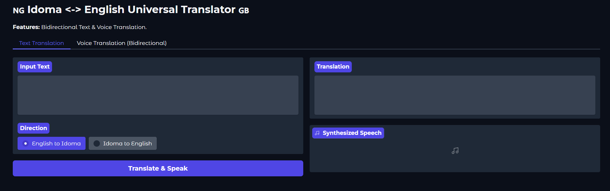
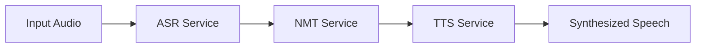

📖 **Abstract**

Most speech technology exists for high-resource languages, leaving low-resource languages like Idoma digitally underrepresented. This project bridges that gap by developing a fully functional Bidirectional English-Idoma Speech System.

The system utilizes an Applied Research Design to solve data scarcity and tonal complexity issues inherent in the Idoma language. It integrates three fine-tuned transformer models to enable natural conversation flow:

- **ASR (Automatic Speech Recognition):** Fine-tuned Wav2Vec 2.0 XLS-R.
- **NMT (Neural Machine Translation):** Fine-tuned NLLB-200.
- **TTS (Text-to-Speech):** Fine-tuned VITS-based MMS-TTS.

**Note: This repository contains just the modularized version of the inference code found in the Jupyter Notebooks. For full implementation codes, check the Juypter Notebooks.**

**Jupyter Notebooks**
- 	[wav2vec2-xls-r-1b-finetuned-idoma](https://colab.research.google.com/drive/1dscH845VLVNNvo4CJGA_c2tyRnyqzv65)
- 	[idoma-mms-tts-eng](https://colab.research.google.com/drive/1pmIVX-UHiZSoFEabPGlLOqPkKWjVD0su)
- [idu-eng-translator](https://colab.research.google.com/drive/1Fijza5Io1zDmoHLZi7DH7mo1NuNjyuDZ#scrollTo=volzYDkBY4qm)
- [Inference code for the bidirectional TTS, STT and NMT](https://colab.research.google.com/drive/1Fijza5Io1zDmoHLZi7DH7mo1NuNjyuDZ#scrollTo=volzYDkBY4qm&line=9&uniqifier=1)
  
🏗️ **System Architecture**

The application follows a Service-Oriented Architecture (SOA) where the UI is decoupled from the inference logic. The processing pipeline for English → Idoma (and vice-versa) follows this flow:



**Core Components**

- **Speech-to-Text (STT):** Converts input audio to text using Wav2Vec2 (Idoma) and Whisper Large v3 (English).
- **Machine Translation (NMT):** Translates text between English and Idoma using NLLB-200.
- **Text-to-Speech (TTS):** Synthesizes the translated text into speech using VITS (Idoma) and SpeechT5 (English).

📊 **Performance Results**

The system was rigorously tested against a held-out test set. Below are the quantitative evaluation metrics reported in the thesis:

| Component      | Model Architecture         | Metric                  | Score        |
| --------------|---------------------------|------------------------|-------------|
| Idoma STT     | Wav2Vec 2.0 XLS-R         | Word Error Rate (WER)  | 11.43%      |
|               |                           | Character Error Rate   | 3.5%        |
| NMT Engine    | NLLB-200                  | BLEU                   | 31.42       |
|               |                           | spBLEU                 | 33.25       |
|               |                           | ChrF++                 | 50.51       |
| Idoma TTS     | VITS MMS-TTS              | MOS (Intelligibility)  | 4.36 / 5.0  |

🔗 **Software Artefacts & Models**

All models and datasets developed during this research are hosted on Hugging Face and are automatically downloaded by this application upon first run.

| Fine-Tuned Models | Function | Model Name | Hugging Face Link |
|-------------------|----------|------------|-------------------|
| STT               | wav2vec2-xls-r-1b-finetuned-idoma | [View Model](https://huggingface.co/mrheartng/wav2vec2-xls-r-1b-finetuned-idoma) |
| TTS               | idoma-mms-tts-eng                | [View Model](https://huggingface.co/mrheartng/idoma-mms-tts-eng) |
| NMT               | idu-eng-translator                | [View Model](https://huggingface.co/mrheartng/idu-eng-translator) |

**Curated Datasets**
- Adah-Idoma Dataset: [mrheartng/adah-idoma](https://huggingface.co/datasets/mrheartng/adah-idoma)
- Idoma TTS (Speaker 1): [mrheartng/idoma-tts-speaker1](https://huggingface.co/datasets/mrheartng/idoma-tts-speaker1)
- Idoma STT (Multi-speaker): [mrheartng/idoma-tts-multiple-speakers](https://huggingface.co/datasets/mrheartng/idoma-tts-multiple-speakers)

🛠️ **Installation & Usage**

**Prerequisites**
- Python 3.8+
- CUDA-enabled GPU (Recommended for faster inference)
- FFmpeg (Required for audio processing)

**Setup**

Clone the repository:
```bash
git clone https://github.com/mrheart/idoma-english-bidirectional-tts-stt.git
cd idoma-english-bidirectional-tts-stt
```

Install dependencies:
```bash
pip install -r requirements.txt
```

Run the application:
```bash
python app.py
```

Access the UI:
Open your browser to the local Gradio URL provided in the terminal (usually http://127.0.0.1:7860).

📂 **Project Structure**

```
├── config/             # Configuration settings and model IDs
├── src/
│   ├── services/       # Core inference logic (ASR, NMT, TTS)
│   ├── model_loader.py # Singleton pattern for memory-efficient model loading
│   └── utils.py        # Audio processing utilities
├── tests/              # Unit tests
├── app.py              # Main entry point (Gradio Application)
└── requirements.txt    # Project dependencies
```

📝 **Citation**

If you use this code, models, or dataset in your research, please cite the thesis:

```bibtex
@mastersthesis{Ojabo2025Idoma,
  author  = {Ojabo, John Heart},
  title   = {Developing a Bidirectional English-Idoma Speech-to-Text (STT) and Text-to-Speech (TTS) System for Enhanced Communication and Language Preservation},
  school  = {University Name},
  year    = {2025}
}
```

📧 **Contact**

For questions regarding the dataset or model fine-tuning parameters, please open an issue in this repository or contact the author via Hugging Face.
